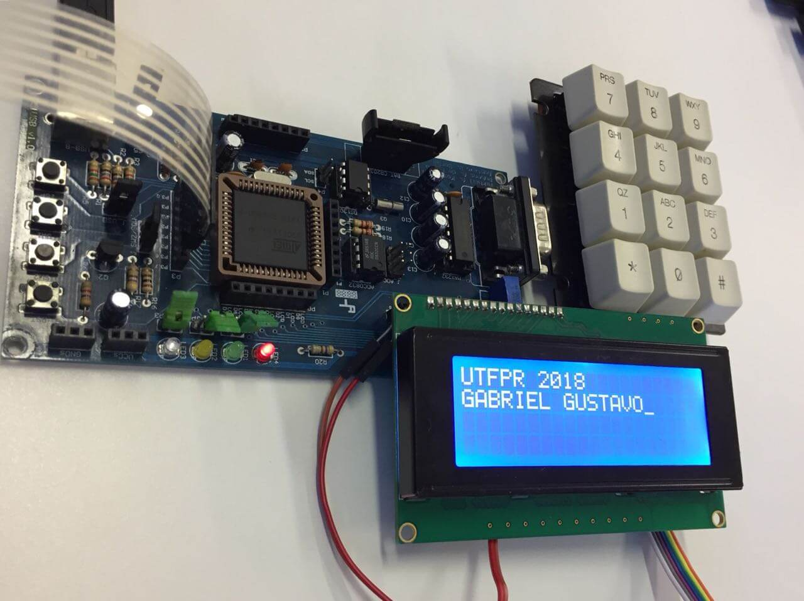

# P51USB
Códigos para placa P51USB desenvolvidos em assembly e C.

### Laboratórios:
 - __LAB 0:__ LCD e Teclado Matricial.
 - __LAB 1:__ Bobinador Motor de Passo.
 - __LAB 2:__ T/C - Motor DC.
 - __LAB 3:__ Serial e A/D.
 - __LAB 4:__ Relógio Multifunção.
  
 

P51USB: https://mikhailkoslowski.github.io/p51usb/index.html

